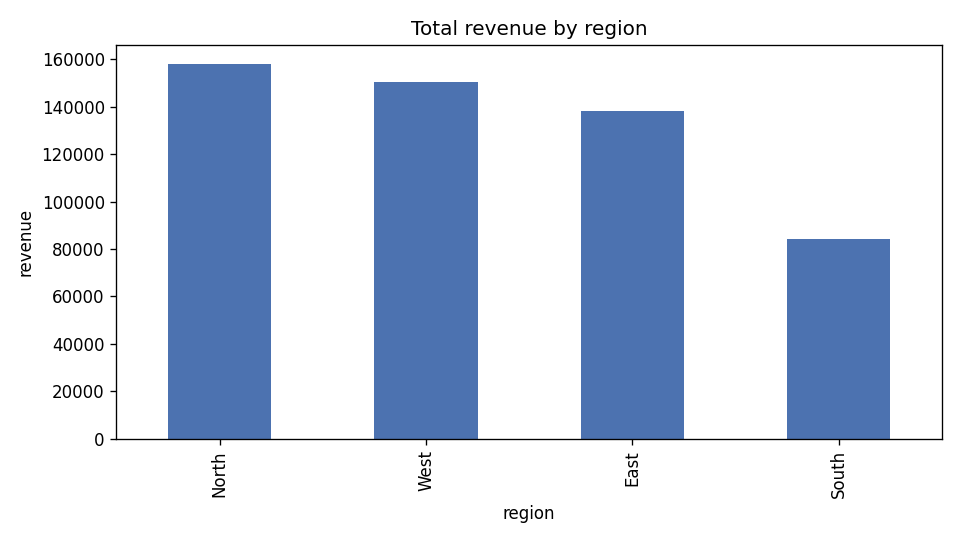

# Analysis Report

> # Executive Summary: Regional Sales Performance Analysis

Our analysis of regional sales data (205 records) confirmed the dataset's overall reliability after removing 5 duplicate or incomplete entries during data cleaning. No significant outliers or anomalies were detected in revenue figures, indicating consistent and trustworthy sales reporting across regions. **The North region emerged as the top performer, generating $158,233 in total revenue across 50 transactions**, making it a key driver of overall business performance. These findings provide a solid foundation for identifying best practices from the North region that could potentially be applied to boost performance in other areas.

## Key findings

- Dataset has 205 rows, 5 duplicate rows, nulls in ['revenue'].
- Cleaning removed 5 rows (duplicates + unrecoverable nulls).
- Outlier check on 'revenue': 0 value(s) outside [-2,183, 7,374] (IQR method).
- Top region by total revenue: North (158,233 across 50 records).

## Aggregation

| region   |      sum |    mean |   count |
|:---------|---------:|--------:|--------:|
| North    | 158233   | 3164.66 |      50 |
| West     | 150325   | 2947.55 |      51 |
| East     | 138325   | 2561.57 |      54 |
| South    |  84259.9 | 1872.44 |      45 |

## Chart

